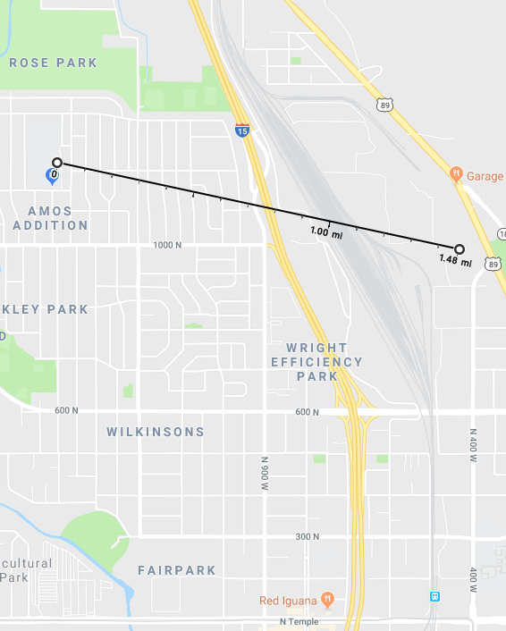

  
```{r setup, include=FALSE}
library(knitr)
knitr::opts_chunk$set(cache = TRUE, warning = FALSE, message = FALSE, 
                      echo = TRUE, dev = 'png',
                      dpi = 200, out.width='650px', fig.width=8, fig.height=4)
```

```{r echo=FALSE}
blogdown::shortcode('tweet', '941522990470127616')
```

## Background

SLC is famous for its winter air pollution (specifically PM2.5). We want to nail down if it's getting better. In our [last post](https://www.levithatcher.com/blog/2018-01-11-inversion-basics-5years/) we looked at hourly measurements from Hawthorne Elementary in SLC proper. The trend was encouragingly downward! But, that post only looked at one site and didn't focus on the winter (when the problem is at its worst).

## The plan

Let's look at 2007-2017 **daily** data to compare Rose Park (EPA site 49-035-3010) and Hawthorne Elementary (site 49-035-3006), both of which are in SLC proper and 5.2 miles apart as the crow flies. We'll work up to a winter by winter comparison over the last ten years.

## Get the data

We download the data from [here](https://aqs.epa.gov/api) and again use these parameters:


Let's read the two flat files into R and combine.

```{r}
library(tidyverse)
# While I could have combined this into one file, I didn't want to mask
# how the original .txt data looked coming from EPA website (reproducibility!)
dfH <- read_csv('../data/SLCPM2_5/SLCHawthorne_PM2.5_Daily_1999-2017.csv')
dfRP <- read_csv('../data/SLCPM2_5/SLCRosePark_PM2.5_Daily_2007-2017.csv')

df <- dplyr::bind_rows(dfH, dfRP)
```

## The analysis

### Summarize and check the data

For brevity, we've loaded in our data and now we'll grab data from the most robust Hawthorne sensor and select only the helpful columns.

```{r}
dfinal <- df %>% 
  # Hawthorne has several options; grab the most complete record
  filter(POC == 1, 
         `AQS Parameter Desc` == 'PM2.5 - Local Conditions') %>% 
  # Change the Site column to be more readable
  mutate(Site = ifelse(`Site Num` == 3006, 'Hawthorne', 'Rose Park')) %>% 
  mutate(Date = as.Date(`Date Local`, format="%m/%d/%Y")) %>%
  rename(Measurement = `Sample Measurement`) %>%
  select(Date, Site, Measurement) %>%
  arrange(desc(Date))

# Look at the data
head(dfinal, 4)
```

Nice and simple. Note that this tibble is the handy [tidy format](https://blog.rstudio.com/2014/07/22/introducing-tidyr/), in that you could add any number of sites and it wouldn't require the annoyance of adding new columns. Let's now count up the average number of observations per year, to see how much data might be missing.

```{r}
dfinal %>% 
  mutate(Year = lubridate::year(Date)) %>%
  filter(Year %in% 2007:2011) %>%
  group_by(Site, Year) %>% 
  summarize(`Measurements Per Site` = length(Measurement))
```

Note that we weirdly have fewer than 365 observations per year (but foruntately still enough to work with). Note sure why these sites have such issues--[anyone](https://twitter.com/levithatcher)?

### Two-site comparison over time

Now that we've simplified the dataset and feel good about its coverage over time, let's see how well the measurements from Hawthorne and Rose Park correspond. While there are statistical ways to do this, let's simply plot.

```{r}
library(scales)
ggplot(dfinal, aes(x = Date, y = Measurement, color = Site)) +
  geom_line() +
  labs(title = "3-Day Running Average PM2.5 in SLC from 2007 - 2017") +
  scale_colour_manual(values = c("black", "red")) +
  scale_y_log10(name = "PM2.5 µg/m3", 
                limits = c(1,NA), 
                breaks = c(1, 5, 10, 15)) +
  scale_x_date(name = "Year-Month",
               labels = date_format("%Y-%m"),
               limits = c(as.Date('2007-01-01'),NA),
               breaks = date_breaks("1 year"))

```

While some missing data, it indeed _looks_ like there is fairly good agreement between the Hawthorne and Rose Park daily PM2.5 values from 2007-2017. And it indeed appears that for both sites winter air quality has generally been improving.

### Differences after [loess smoothing](https://en.wikipedia.org/wiki/Local_regression)

Even though Hawthorne and Rose Park mostly track together, how to they differ overall? To check longer-term differences, let's plot with a `loess` smoother (which is built into `ggplot2`). 

```{r}
ggplot(dfinal, aes(x = Date, y = Measurement, color = Site)) +
  geom_smooth(method = 'loess') +
  labs(title = "Smoothed PM2.5 in SLC from 1999 - 2017") +
  scale_colour_manual(values = c("black", "red")) +
  scale_y_continuous(name = "PM2.5 µg/m3",
                     breaks = c(6, 8, 10, 12)) +
  scale_x_date(name = "Year",
               limits = c(as.Date('1999-01-01'),
                          as.Date('2017-12-01')),
               labels = date_format("%Y"), 
               breaks = date_breaks("1 year"))

```

**Overall**, note the downward Hawthorne trend since ~2004! Interestingly Rose Park PM2.5 levels are typically higher than those at Hawthorne Elementary (which is in the Liberty Wells neighborhood). Let's zoom a bit, since Rose Park data starts so much later.

```{r}
ggplot(dfinal, aes(x = Date, y = Measurement, color = Site)) +
  geom_smooth(method = 'loess') +
  labs(title = "Smoothed PM2.5 in SLC from 2008 - 2017") +
  scale_colour_manual(values = c("black", "red")) +
  scale_y_continuous(name = "PM2.5 µg/m3",
                     breaks = c(8, 10, 12)) +
  scale_x_date(name = "Year-Month",
               labels = date_format("%Y-%m"), 
               breaks = date_breaks("1 year")) +
  # Zooming w/o affecting smoother
  coord_cartesian(xlim=c(as.Date('2008-01-01'),
                         as.Date('2017-12-01')), 
                  expand = FALSE)
```

Over much of the last six years there's been a difference of ~1 µg/m3 between the sites. While that level of background difference doesn't seem like much, this smoothing likely hides shorter-term spikes; what's scary is even differences in low-level PM2.5 exposure [can lead to adverse health effects](http://www.nejm.org/doi/full/10.1056/NEJMoa1702747).

```{r echo=FALSE}
blogdown::shortcode('tweet', '956547307838750720')
```

While this is speculation, the heightened PM2.5 levels in Rose Park _could_ be due to proximity to the local refinery, which is just 1.5 miles east of the air quality measurement site (although it's totally lost on me why the difference is exacerbated in 2012).



### Winter comparisons for both sites

Now, let's make the year-over-year *winter* comparison crystal clear. Note that because we're only comparing winters, we need a winter column that allows us to use [faceting](http://ggplot2.tidyverse.org/reference/facet_grid.html) in ggplot2. (Thanks to [Mike Levy](https://twitter.com/ucdlevy) for the seasonal support here.)

```{r}
dividers <- as.Date(paste0(2007:2017, "06", "01"), format = "%Y%m%d")

dfinal <- dfinal %>%
  mutate(Season = cut(as.numeric(Date), 
                      as.numeric(dividers), 
                      include.lowest = TRUE),
         Season = as.numeric(Season),
         Month = lubridate::month(Date)) %>% 
  filter(Date > as.Date('2006-06-01'),   
         Month %in% c(1,2,11,12), # Only care about winter months
         !is.na(Season))          # This avoids an NA facet panel
```

And now we plot PM2.5 levels for five winters at Hawthorne and Rose Park.

```{r}
# Add custom winter label for faceting
season_names <- c(
  '1' = "2007-08",
  '2' = "2008-09",
  '3' = "2009-10",
  '4' = "2010-11",
  '5' = "2011-12",
  '6' = "2012-13",
  '7' = "2013-14",
  '8' = "2014-15",
  '9' = "2015-16",
  '10' = "2016-17")

ggplot(dfinal, aes(x = Date, y = Measurement)) + 
  geom_smooth(method = "loess") +
  scale_y_log10(name = "PM2.5 µg/m3",
                breaks = c(3, 5, 7, 10, 15, 20, 30, 40, 50)) +
  scale_x_date(name = "Winter Month",
               labels = date_format("%m"),
               breaks = date_breaks("1 month")) +
  # Zooming w/o affecting smoother
  coord_cartesian(ylim = c(3,40)) +
  facet_grid(Site ~ Season, 
             scale = "free", 
             labeller = labeller(Season = as_labeller(season_names)))
```

First, note how similar the patterns are between Rose Park and Hawthorne for a given winter--it's heartening to see the signal is roughly what we'd expect. There is some missing data, however, which is why there's so much gray in Hawthorne for 2014-15.

## Conclusion

Overall, for Hawthorne Elementary (which has [the most accurate](http://home.chpc.utah.edu/~whiteman/PM2.5/PM2.5.html#current_conc) measurements in the Salt Lake Valley), it's pretty clear that at least the last two winters have had nearly the lowest PM2.5 levels of the last 10 years. Note that winter 2010-2011 had remarkable air as well. Rose Park confirms this. 

While a couple of relatively pollution-free winters _could_ be due to meteorgological conditions (i.e., fewer high-pressure ridges), the fact that this decline in PM2.5 in the Salt Lake Valley is corroborated by the longer term trends shown above gives me confidence that this is a true decline in background pollution.

**What does this mean for policy advocacy in Utah?** This downward trend _is_ encourgaging and, when combined with the fact that Salt Lake County is _still_ an [serious EPA PM2.5 non-attainment area](https://deq.utah.gov/Pollutants/P/pm/pm25/serious-area-state-implementation-plans/index.htm), it gives us reason to believe that brave policy changes can eventually make SLC safe enough for all folks to go outside every winter day. Doesn't seem too ambitious, right? 

_**Note, see [here](https://le.utah.gov) to track the 2018 Utah Legislative session.**_