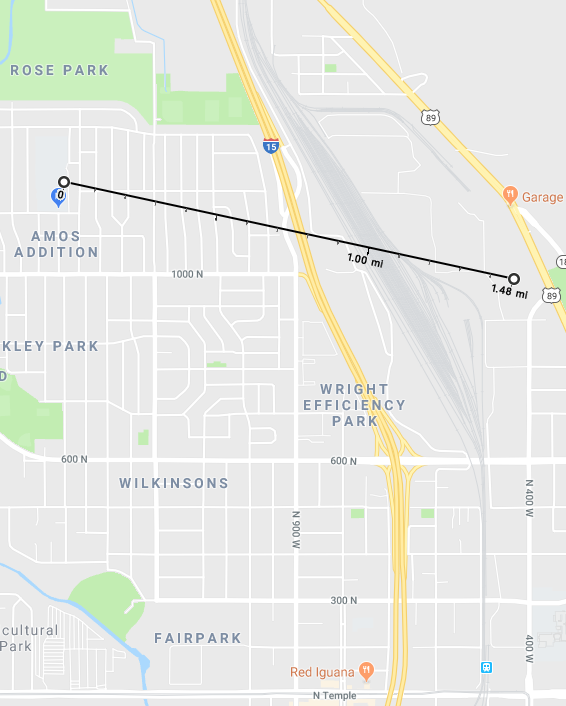

  
```{r setup, include=FALSE}
library(knitr)
knitr::opts_chunk$set(cache = TRUE, warning = FALSE, message = FALSE, 
                      echo = TRUE, dev = 'png',
                      dpi = 200, out.width='650px', fig.width=8, fig.height=4)
```

## Background

## The Plan

Let's look at 2012-2017 **daily** data to compare Rose Park (49-035-3010) and Hawthorne Elementary (49-035-3006), both of which are in SLC proper and X miles apart as the crow flies. We download the data from [here](https://www.epa.gov/outdoor-air-quality-data/download-daily-data). 

## Get the data


```{r, include=FALSE}
library(tidyverse)
# While I could have batched this into one file, I didn't want
# to mask how the original data looked coming from EPA website (reproducibility!)
dfH <- read_csv('../data/SLCPM2.5Winter/HawthorneDaily-2007-2017.csv')
dfRP <- read_csv('../data/SLCPM2.5Winter/RoseParkDaily-2007-2017.csv')

df <- dplyr::bind_rows(dfH, dfRP)
```

## The analysis

### Summarize and check the data

For brevity, we've loaded in our data and now will trim out the sites that aren't Hawthorne / Rose Park, and only grab only the columns necessary.

```{r}
dfinal <- df %>% 
  # Hawthorne has several options; grab the most complete record
  filter(POC == 1,
         `AQS Parameter Desc` == 'PM2.5 - Local Conditions',
         `Site Num` == 3006 | `Site Num` == 3010) %>%
  # Change the Site column to be more readable
  mutate(Site = ifelse(`Site Num` == 3006, 'Hawthorne', 'Rose Park')) %>% 
  mutate(Date = as.Date(`Date Local`, format="%m/%d/%Y")) %>%
  rename(Measurement = `Sample Measurement`) %>%
  select(Date, Site, Measurement) %>%
  arrange(Date)

# Look at the data
print(dfinal, 3)
```

Let's now count up the average number of observations per year, to see how much data might be missing.

```{r}
dfinal %>% 
  mutate(Year = lubridate::year(Date)) %>%
  filter(Year %in% 2007:2011) %>%
  group_by(Site, Year) %>% 
  summarize(`Measurements Per Site` = length(Measurement))
```

Note that we weirdly have fewer than 365 observations per year (but foruntately still enough to work with). Note sure why these sites have such issues--[anyone](https://twitter.com/levithatcher)?

### Running average two-site comparison over time

Now that we have a simple two-site table to work with, let's see how well the measurements correspond. First, let's  pivot the table such that both sites are in their own column and [compute](https://stackoverflow.com/a/4862334) a 3-day running average.


```{r}
# df_pivot <- dfinal %>% 
#   tidyr::spread(Site, Measurement)
# 
# # Compute 3-day moving average
# ma <- function(x, n = 3) {
#   stats::filter(x, rep(1/n, n), sides = 2)
# }
# 
# df_pivot$`Hawthorne MA` <- ma(df_pivot$Hawthorne)
# 
# df_pivot$`Rose Park MA` <- ma(df_pivot$`Rose Park`)
# 
# # How do we do this?
# dfinal <- dfinal %>% 
#   filter(Site = Hawthorne) %>% 
#   mutate(`Hawthorne MA` = ma(Measurement))
```

Now we plot the 3-day running average for both Hawthorne and Rose Park.

```{r}
# TODO: use new data to do 2007-2017
# TODO plot running average using tidy format
library(scales)
ggplot(dfinal, aes(x = Date, y = Measurement, color = Site)) +
  geom_line() +
  labs(title = "3-Day Running Average PM2.5 in SLC from 2007 - 2017") +
  scale_colour_manual(values = c("black", "red")) +
  scale_y_log10(name = "PM2.5 µg/m3", 
                limits = c(1,NA), 
                breaks = c(1, 5, 10, 15)) +
  scale_x_date(name = "Year", 
               labels = date_format("%Y-%m-%d"), 
               breaks = date_breaks("1 year"))

```

While the missing data is annoying, it indeed _looks_ like there is fairly good agreement between the Hawthorne and Rose Park daily PM2.5 values from 2007-2017. And it indeed appears that for both sites winter air quality has generally been improving (more to come below).

### Differences after [loess smoothing](https://en.wikipedia.org/wiki/Local_regression)

Even though Hawthorne and Rose Park both move together, how to they differ? To check longer-term differences, let's plot with a `loess` smoother (which is built into `ggplot2`).

```{r}
ggplot(dfinal, aes(x = Date, y = Measurement, color = Site)) +
  geom_smooth(method = 'loess') +
  labs(title = "Smoothed PM2.5 in SLC from 2007 - 2017") +
  scale_colour_manual(values = c("black", "red")) +
  scale_y_log10(name = "PM2.5 µg/m3", 
                breaks = c(2, 5, 6, 8, 10, 12, 15)) +
  scale_x_date(name = "Year", 
               labels = date_format("%Y-%m-%d"), 
               breaks = date_breaks("1 year"))

```

**Overall**, outside of a spike in 2011-2012, note the downward trend. Interestingly Rose Park PM2.5 levels are systematically higher than those at Hawthorne Elementary (which is in the Liberty Wells neighborhood). Over the last five years there's been a difference of ~1 ug/m3. While that level of background difference doesn't seem like much, this smoothing likely hides shorter-term spikes; what's scary is even differences in low-level PM2.5 exposure [can lead to adverse health effects](http://www.nejm.org/doi/full/10.1056/NEJMoa1702747). 

While this isn't confirmed, the heightened PM2.5 levels in Rose Park could be due to proximity to the local refinery, which is just 1.5 miles east of the air quality measurement site.



Not enough data to make a solid conclusion, however. Can look more in future!

### Winter comparisons for both sites

Now, let's make the year-over-year *winter* comparison crystal clear. First for Hawthorne. Note that because we're only comparing winters, we need a winter column that allows us to use faceting in ggplot2 (thanks to [Mike Levy](https://twitter.com/ucdlevy) for the seasonal support here).

```{r}
dividers <- as.Date(paste0(2007:2017, "06", "01"), format = "%Y%m%d")

dfinal <- dfinal %>%
  mutate(Season = cut(as.numeric(Date), as.numeric(dividers), 
                      include.lowest = TRUE),
         Season = as.numeric(Season),
         Month = lubridate::month(Date)) %>% 
  filter(Month %in% c(1,2,11,12), # Only care about winter months
         !is.na(Season))          # This avoids an NA facet plot
```

And now we plot PM2.5 levels for five winters at Hawthorne and Rose Park.

```{r}
# Add custom winter label for faceting
season_names <- c(
  '1' = "2007-08",
  '2' = "2008-09",
  '3' = "2009-10",
  '4' = "2010-11",
  '5' = "2011-12",
  '6' = "2012-13",
  '7' = "2013-14",
  '8' = "2014-15",
  '9' = "2015-16",
  '10' = "2016-17")

ggplot(dfinal, aes(x = Date, y = Measurement)) + 
  geom_smooth(method = "loess") +
  scale_y_log10(name = "PM2.5 µg/m3",
                limits = c(2,NA), 
                breaks = c(2, 5, 7, 10, 15, 20, 30, 40, 50)) +
  scale_x_date(name = "Winter Month",
               labels = date_format("%m"),
               breaks = date_breaks("1 month")) +
  facet_grid(Site ~ Season, scale = "free", labeller = labeller(Season = as_labeller(season_names)))
```

First, note how similar the patterns are between Rose Park and Hawthorne for a given year--it's heartening to see the signal is roughly what we'd expect. There is some missing data, however, which is why there's so much gray in Hawthorne for 2014-15.

Overall, at Hawthorne Elementary (which has [the most accurate](http://home.chpc.utah.edu/~whiteman/PM2.5/PM2.5.html#current_conc) measurements in the Salt Lake Valley), it's pretty clear that the last three winters have had the lowest PM2.5 levels of the last 10 years. 